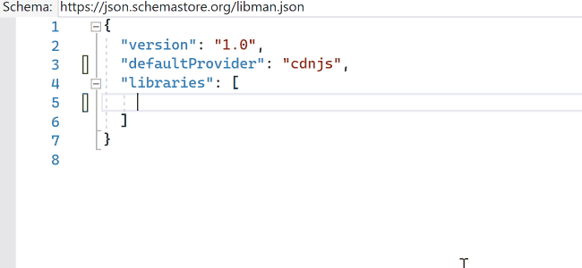

# Microsoft Library Manager

Install and consume 3rd-party client-side libraries with ease.

## Reasons to use LibMan
1.	For apps not currently using another package manager
2.	For projects where you think Bower and npm are overkill
3.	For developers that don't want to use Bower/Yarn or npm
4.	For developers that value simplicity in their tools
5.	For using custom or private packages/files
6.  For orchestrating file placement within your project

## Reasons NOT to use LibMan
1.	Developer/team likes using tools such Bower, Yarn or npm
2.	For apps that uses WebPack or Browserify for module loading/bundling

## Features

- Add any library from [cdnjs.com](https://cdnjs.com/), [jsdelivr.com](https://www.jsdelivr.com/), or [unpkg.com](https://unpkg.com/)
- Add any file from file system, network share or remote URL
- Only add the file(s) you need
- Can install any file into any folder in your project/solution
- Very fast

## Installation
- Fully integrated into Visual Studio 2017 and newer
- Available as an add-in for Visual Studio for Mac
  - From the main menu, open the Extensions Manager dialog.
  - Select the Gallery tab.
  - Expand IDE extensions.
  - Select the Library Manager addin
  - Click the Refresh button if the addin is not visible.
  - Click Install… to install the addin.
  - Restart Visual Studio for Mac.

  Please read the [LibMan support in Visual Studio for Mac blog post](https://lastexitcode.com/blog/2019/07/13/LibManSupportInVisualStudioMac8-1/) for more details
- Available as a dotnet global tool - [Microsoft.Web.LibraryManager.Cli](https://www.nuget.org/packages/Microsoft.Web.LibraryManager.Cli/)
## Getting started
Right-click any web project in Solution Explorer and hit **Manage Client-side Libraries...**.

This will create a `libman.json` file in the root of the project.

## libman.json

### Context menu
Right-click `libman.json` in Solution Explorer to access commands that help managing the libraries.

### Intellisense
Edit the libman.json file to install libraries. Every time the file is saved, Visual Studio will install/restore the packages.

See [libman.json reference](https://github.com/aspnet/LibraryManager/wiki/libman.json-reference) for more information.

### Light bulbs
Inside libman.json there are light bulbs that show up with helpful commands.

## Road map and release notes
See the [CHANGELOG](CHANGELOG.md) for road map and release notes

# Feedback

Check out the [contributing](.github/CONTRIBUTING.md) page to see the best places to log issues and start discussions.

# Reporting Security Issues

Please refer to [SECURITY.md](SECURITY.md)
