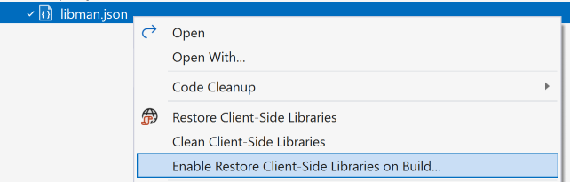

# Microsoft Library Installer

Install and consume 3rd-party client-side libraries with ease.

## Features

- Add any library from [cdnjs.com](https://cdnjs.com/)
- Add any file from file system, network share or remote URL
- Only add the file(s) you need
- Can install any file into any folder in your project/solution
- Optional manifest file (`library.json`)
- Very fast
- Full Visual Studio 2017 integration

## Getting started
Right-click any web project in Solution Explorer and hit **Manage Client-side Libraries...**.

This will create a `library.json` file in the root of the project.

## library.json

### Context menu
Right-click `library.json` in Solution Explorer to access commands that help managing the libraries.

### Intellisense
Edit the library.json file to install libraries. Every time the file is saved, Visual Studio will install/restore the packages.

See [library.json reference](https://github.com/aspnet/LibraryInstaller/wiki/library.json-reference) for more information.

### Light bulbs
Inside library.json there are light bulbs that show up with helpful commands.

## Road map and release notes
See the [CHANGELOG](CHANGELOG.md) for road map and release notes

# Feedback

Check out the [contributing](.github/CONTRIBUTING.md) page to see the best places to log issues and start discussions.
